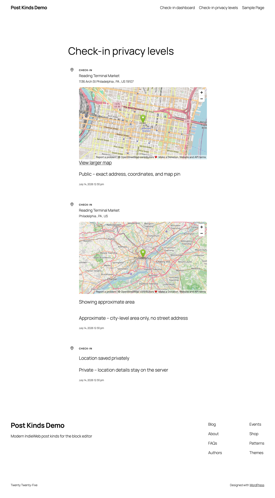

What the plugin stores, what it sends to other services, and what appears in your site's public markup. Everything here is verified against the plugin code as of version 1.0.0, apart from the check-in map's tiles and consent hook, which describe 1.9.0; open questions are listed at the end.

## What the plugin stores on your site

- **Posts and post meta.** All content lives in regular WordPress posts and post meta (meta keys prefixed `_postkind_`). The plugin creates no custom database tables.
- **Check-in location data.** Check-ins store venue details, latitude/longitude, and a per-post `geo_privacy` value (public / approximate / private). No setting rounds or discards coordinates before storing them; what visitors see follows the post's privacy level, described below.
- **Options.** Settings, import history/state, webhook secrets and logs, and API credentials are stored in the WordPress options table. Credentials include API keys and OAuth access/refresh tokens (Trakt, Simkl, Foursquare, Last.fm session key). **Keys and tokens are stored as plugin options in the database; this documentation makes no encryption claim** (the plugin readme's "encrypted where possible" wording is flagged for maintainer review below).
- **Transients** for cached API responses (clearable from Settings → Tools).
- **Taxonomies.** The plugin adds the `kind` taxonomy (with 36 terms) and a `venue` taxonomy with term meta (Foursquare/OpenStreetMap ids, coordinates). It can also register a `reaction` post type if the import storage mode is switched from its default.
- **Scheduled tasks** (WP-Cron) for background imports and syncs.

On uninstall (deleting the plugin from the Plugins screen), the uninstall routine deletes all plugin options — including API credentials, OAuth tokens for each service, webhook secrets and logs — plus plugin transients, and unschedules its cron events. Your posts, meta, and taxonomy terms remain, since they're your content.

## Check-in location privacy

Each check-in has a privacy level (per post, with a site default under Settings → Checkin), and the plugin enforces it in the public microformats markup:

- **Public** — full venue name, street address, and exact coordinates appear in the markup.
- **Approximate** — locality/region/country appear; street address and coordinates are withheld.
- **Private** — the location is stored in your database but venue, address, and coordinates are all withheld from the public page.



What visitors see of a check-in's location, coordinates included, follows each post's Location Privacy setting in the block editor: Public (exact location), Approximate or Private (hidden). Where the card and the post's stored setting differ, the stricter one applies (see [When a card and the post's setting disagree](#when-a-card-and-the-posts-setting-disagree)). No separate setting rounds, hides or discards coordinates.

## RSVP event location

An RSVP's event location stays private unless you turn on **Show event location publicly** in the RSVP card's Event Details panel. It's off by default, for every RSVP status and for past and upcoming events, and RSVPs saved before this setting existed count as private. While it's off, the location is left out of the public page, the Stream, feeds, ActivityPub and ATmosphere copies, and the REST API for anyone who can't edit the post, and the card prints the same markup as an RSVP with no location. The event name, date, your response and the link to the event page still appear. Logged in, you see the same page your visitors do; the location stays in the block editor, where only people who can edit the post see it. In a post with more than one RSVP card, a card shows its location only when its own toggle and the first RSVP card's toggle are both on. This holds whatever kind the post is set to, Event included. An event post announces its own location, so its stored event location is public only when the post has no RSVP card, no RSVP kind and no saved RSVP data: no response from the sidebar, Quick Post or the RSVP meta box, and no location setting from an RSVP card. Deleting a post's RSVP cards doesn't delete the first card's saved setting, so the location stays hidden unless that card's toggle was on. If the post's own location privacy is Private (`_pkiw_geo_privacy`, or Simple Location's visibility set to private), the location stays hidden even with the toggle on.

## When a card and the post's setting disagree

A check-in card's Location Privacy and an RSVP card's **Show event location publicly** each share one stored setting with the post, `_pkiw_geo_privacy` and `_pkiw_rsvp_location_privacy`. The REST API, the `post-kinds/update-post-meta` and `post-kinds/create-post` abilities, `wp post meta update` and other plugins can write that setting too. When the card and the stored setting disagree, the stricter one wins: Private, then Approximate, then Public for a check-in, and private, then public for an RSVP. Saving the post, the card data backfill and every change to the stored setting through WordPress's post meta functions keep the stricter value, so making a location more public takes both: the card and the stored setting.

Once a stricter value is stored, whether the card saved it or something else did, switching only the card to a looser setting leaves the location as hidden as before. An RSVP card stores its setting every time the post is saved, so an RSVP saved with the toggle off stays private until both change. The block editor has no control for the stored setting. To make a location more public, change the card and save the post first, then change the stored setting through the REST API (`meta` on `/wp/v2/posts/<id>`), the `post-kinds/update-post-meta` ability, or `wp post meta update <id> _pkiw_rsvp_location_privacy public`. A stored setting changed first is held to the card's stricter setting, and the card change after it can't loosen it. Deleting the stored setting counts as setting it to Approximate for a check-in and private for an RSVP, and a Private check-in card writes its setting back. A check-in card left at its default counts as Approximate. Only a post's first card counts, as for the rest of its card data: a check-in card placed after a read, comic, eat, drink, listen, watch, jam or play card, or an RSVP card inside a synced pattern, doesn't hold the stored setting. A post with no card keeps whatever setting is stored.

## What the plugin sends to external services

**Lookups, imports, and scrobble ingestion.** When you search for media, import history, or auto-fetch metadata, the plugin makes outbound requests to the relevant service. Services present in the plugin's code:

- Music: MusicBrainz, ListenBrainz, Last.fm, Cover Art Archive
- Movies/TV: TMDB (including its image host), Trakt, Simkl, TVmaze
- Books/articles: Open Library (including covers), Google Books, Readwise
- Podcasts: Podcast Index
- Games: RAWG, BoardGameGeek/VideoGameGeek
- Places: Foursquare, Nominatim (OpenStreetMap)
- Other: Untappd (code present; its API currently requires a commercial agreement), and oEmbed providers (YouTube, Spotify, and similar) for embeds
- **Letterboxd page fetches:** pasting a Letterboxd URL into a watch lookup makes the plugin fetch that Letterboxd page's HTML to extract the film's TMDB id — an outbound request to letterboxd.com worth knowing about.
- **Amazon Kindle previews:** when a read post embeds a Kindle book preview, the preview frame loads in the browser — yours in the editor, your visitors' on the published post — directly from read.amazon.com with the book's ID in the URL. The plugin's server sends nothing to Amazon; the request comes from whoever views the post, so Amazon sees their IP address the same way any embedded frame's host does.

These requests carry your search terms or media identifiers (and your API credentials for that service). The plugin readme states API calls retrieve only public metadata and that the plugin includes no analytics or tracking.

**Map tiles.** The check-in archive map and the Check-in Dashboard block's map load their tiles in each visitor's browser, from `tile.openstreetmap.org` unless you change it. The Reactions → Check-ins admin screen uses the same tiles in the signed-in user's browser. The OpenStreetMap Foundation's tile server receives the visitor's IP address, user agent, the referrer your site's referrer policy allows, and the tile coordinates of the area on screen. Each map requests tiles under its own condition:

- **Archive map:** only when a check-in on the page has a pin. A visitor gets pins for check-ins whose location is public. A signed-in user who can edit a check-in gets its pin whatever its privacy, so an editor's browser requests tiles on a page of private check-ins.
- **Check-in Dashboard block:** when its Map view is showing (the block's layout is Map, or the visitor picks Map) and one of the check-ins it lists has coordinates that viewer may see: a public check-in for a visitor, any check-in with coordinates for a user who can edit it. With none, the block draws no map and requests no tiles.
- **Reactions → Check-ins screen:** when the signed-in user opens its Map view.

Leaflet and MarkerCluster load from the plugin's own `assets/vendor` folder, not a CDN. See the [tile usage policy](https://operations.osmfoundation.org/policies/tiles/) and the [OSMF privacy policy](https://osmfoundation.org/wiki/Privacy_Policy), and name the service in your own privacy policy, or move all three maps to another provider with two filters:

- `pkiw_map_tile_url`: the Leaflet tile URL template. Default `https://tile.openstreetmap.org/{z}/{x}/{y}.png`.
- `pkiw_map_tile_attribution`: the attribution HTML, which stays visible on the map. Only links (`<a>` with `href` and `rel`) survive. Default `&copy; <a href="https://www.openstreetmap.org/copyright">OpenStreetMap</a> contributors`.

```php
add_filter( 'pkiw_map_tile_url', fn() => 'https://tiles.example.com/{z}/{x}/{y}.png' );
add_filter( 'pkiw_map_tile_attribution', fn() => '&copy; <a href="https://www.openstreetmap.org/copyright">OpenStreetMap</a> contributors, tiles by Example' );
```

**Content-Security-Policy hosts.** If your site sends a `Content-Security-Policy` header, the maps need these hosts:

| Directive | Host | Used by |
|---|---|---|
| `img-src` | `https://tile.openstreetmap.org` (or the host in your `pkiw_map_tile_url`) | Check-in archive map and Check-in Dashboard block map on the front end, and the Reactions → Check-ins screen in wp-admin |
| `frame-src` | `https://www.openstreetmap.org` | The map embedded in a check-in card: on the front end when its location is public or the viewer can edit the post, in the editor unless it's private |

**Standard.site record lookups.** When you press **Check this URL** in a card block's sidebar, or a few seconds after you publish a post whose card cites a URL, the plugin follows a chain of up to three requests:

1. **The cited page itself**, to read its `site.standard.document` tag. An ordinary request for a URL you already linked to.
2. **plc.directory**, to turn the identifier in that tag into the address of the server holding the record. Operated by Bluesky Social PBC. Skipped for `did:web` identifiers, which name their own host instead.
3. **That server**, to read the record.

No credentials are involved at any step, and nothing about you or your site is sent beyond what any HTTP request carries.

The third host is the part worth understanding: it is not a fixed service. It is whichever Personal Data Server the author of the page you cited happens to use, so which hosts get contacted depends entirely on which pages you bookmark. All three requests use `wp_safe_remote_get()`, which will not follow a URL into your own network.

Results are cached for a day, misses included, so a page is not re-fetched on every save. Nothing is contacted for a card with no URL, and a page that turns out not to be on AT Protocol costs one request, not three.

Only the resolved record's address is stored, in the `_pkiw_standard_site_uri` post meta key, and only when the record verifies against the page it was found on.

**Holding the archive map until consent.** To hold the check-in archive map until a visitor consents, return `true` from `pkiw_checkin_map_requires_consent`. The map container then carries `data-pkiw-consent="required"` and stays hidden, with no tile requests, until your consent tool dispatches a `pkiw:map-consent` event on `document`, or sets `window.pkiwMapConsent = true` before the map script starts. Do both: the flag covers consent given before the script runs, the event covers consent given after, including before the page finishes loading. The list of check-ins prints in full while the map waits. A map already drawn stays until the next page load if consent is withdrawn. This covers the archive map; the Check-in Dashboard block's map doesn't read the filter.

```php
add_filter( 'pkiw_checkin_map_requires_consent', '__return_true' );
```

With the [WP Consent API](https://wordpress.org/plugins/wp-consent-api/), in a script that loads after it (use the category your consent tool files third-party content under):

```js
function pkiwAllowMap() {
    window.pkiwMapConsent = true;
    document.dispatchEvent( new Event( 'pkiw:map-consent' ) );
}

if ( typeof wp_has_consent === 'function' && wp_has_consent( 'marketing' ) ) {
    pkiwAllowMap();
}

document.addEventListener( 'wp_listen_for_consent_change', ( event ) => {
    if ( 'allow' === event.detail.marketing ) {
        pkiwAllowMap();
    }
} );
```

**POSSE syndication (outbound publishing).** The plugin sends your activity to Last.fm, Trakt, or Foursquare **only when you enable the matching toggle** (Scrobble to Last.fm, Sync to Trakt, Sync to Foursquare). All three default to off.

**Webhooks (inbound).** Plex, Jellyfin, Trakt, ListenBrainz, and generic webhooks push data *to* your site; deliveries are verified with an HMAC-SHA256 signature against your webhook secret.

**AI features.** AI enhancements (auto-populate, tag suggestions, review prompts) are doubly gated: they require the WordPress AI Client (WordPress 7.0+) to be available *and* the plugin's AI option to be enabled. When active, they send media metadata to whichever AI provider your site's WP AI Client is configured to use. Exactly what is sent, and to which provider, depends on that site-level configuration — see the maintainer-review list below.

## Standard.site publishing (through ATmosphere)

This section applies only when the optional ATmosphere companion plugin is installed. Once you connect an AT Protocol account there, eligible published posts are written to your Personal Data Server as public `site.standard.document` records — title (including the titles Post Kinds derives for untitled kinds), your post's address, publish date, excerpt, plain-text content, tags (including the kind), and the featured image. These records live **outside your WordPress database**, on your PDS, and propagate to public AT Protocol indexers. Unpublishing, trashing, or deleting a post removes its record through ATmosphere; disconnecting stops publishing but leaves existing records on your PDS until removed.

What Post Kinds controls on top of ATmosphere's own eligibility rules:

- Thin signal kinds (likes, reposts, favorites, follows, tags) and privacy-sensitive kinds — check-ins, moods, wishes, acquisitions, weather, exercise, sleep, trips, itineraries — never publish unless you turn them on, per kind or per post. Public logs (listens, watches, reads, plays, eats, drinks, jams) publish by default, carrying only what their public pages already show.
- A check-in that does publish follows your existing check-in privacy setting: a private check-in's derived title is just "Checked in", and the record's text comes from the same privacy-filtered rendering your site shows. Eat and drink posts have optional venue fields with no equivalent privacy tier — whatever venue detail the public card shows is what the record carries.
- Drafts, scheduled, private, and password-protected posts never publish — that's ATmosphere's own gate, which Post Kinds narrows and never widens.

Credentials never touch this plugin: the AT Protocol connection, its tokens, and their encryption are ATmosphere's alone.

## Frontend markup

Yes, the plugin adds markup to your public pages: microformats2 classes on kind posts (`h-entry` roots, `kind-<slug>` post classes, properties like `u-listen-of`, `u-checkin`, `p-rating`), hidden `<data>` elements for RSVP/check-in/review/event details, and the rendered card/dashboard blocks themselves. Check-in markup is redacted per the privacy level described above. Posts using IndieBlocks blocks are left to IndieBlocks' own microformats.

## Other WordPress data the plugin touches

- **Posts:** kind assignment on save (from the first card block, never overriding a manual choice), optional default category on first save, and optional post-format ↔ kind syncing.
- **Post meta:** card and location fields under `_postkind_`, plus `pkiw_promote` (public, REST-visible) and `_pkiw_surface` (protected) for stream/main routing. The plugin never filters your site's queries for surfaces — it only records the signal.
- **Media library:** with the default "Download to Media Library" image handling, cover art from external services is sideloaded into your uploads.
- It does not modify comments, users, or links.

## What was verified, and what needs maintainer review

Verified from code: options and meta storage, no custom tables, the uninstall cleanup list, privacy-level redaction in markup, the outbound hosts above, the POSSE and AI opt-in gates, and webhook signature verification.

Needs maintainer review (also listed in the [documentation plan](https://github.com/courtneyr-dev/post-kinds-for-indieweb/blob/main/docs/documentation-plan.md)):

- **"API keys encrypted where possible" (readme claim).** The code stores credentials as sanitized plaintext values in the options table; no encryption path was found. The claim should be confirmed or softened by the maintainer — until then, assume keys are stored unencrypted and protect your database accordingly.
- **AI data flows.** The precise payload and destination provider depend on the site's WP AI Client configuration and weren't traced in full.
- **ActivityPub.** Listed in the readme as an optional companion; no code integration was found, so no data flows to it from this plugin as far as verified.
