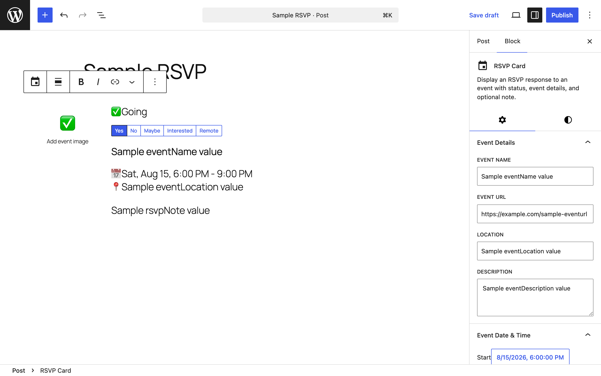
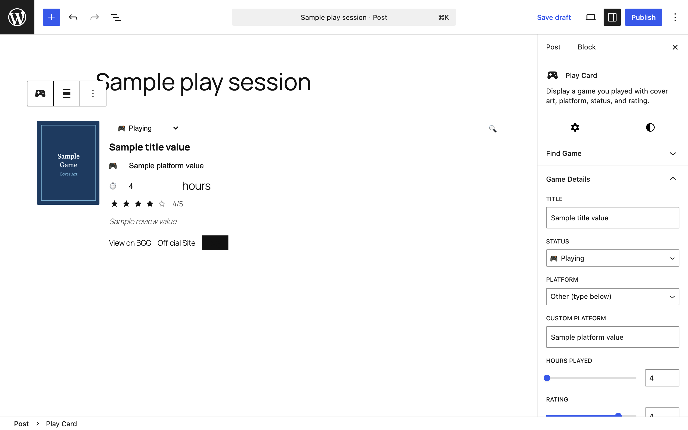
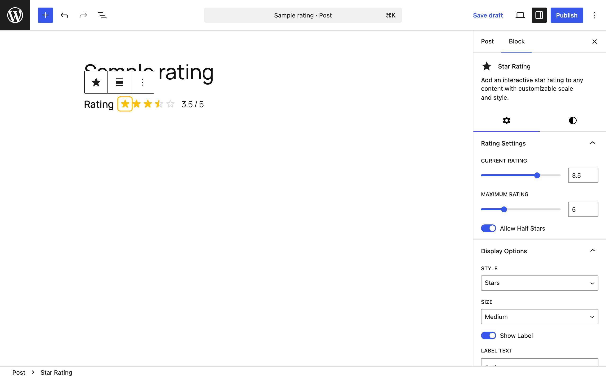
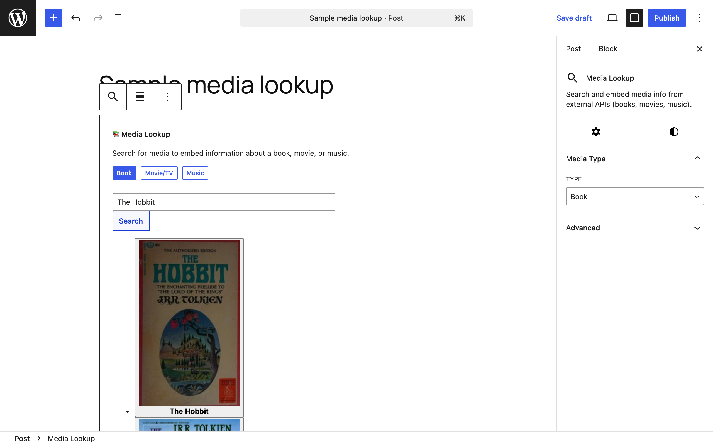
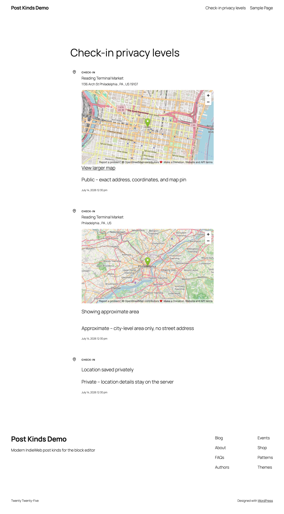
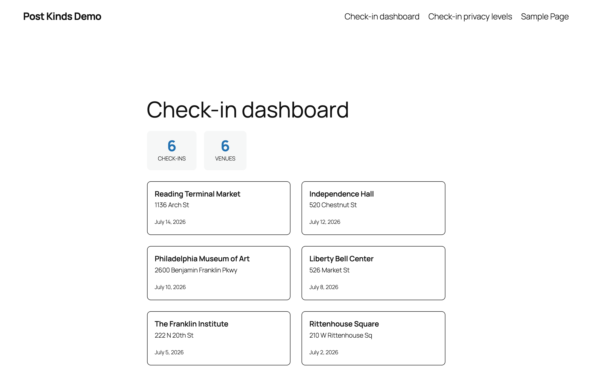
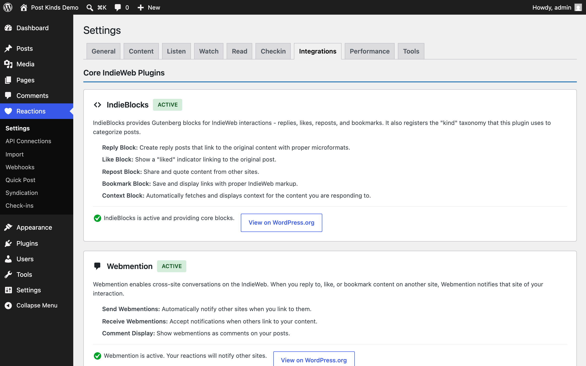
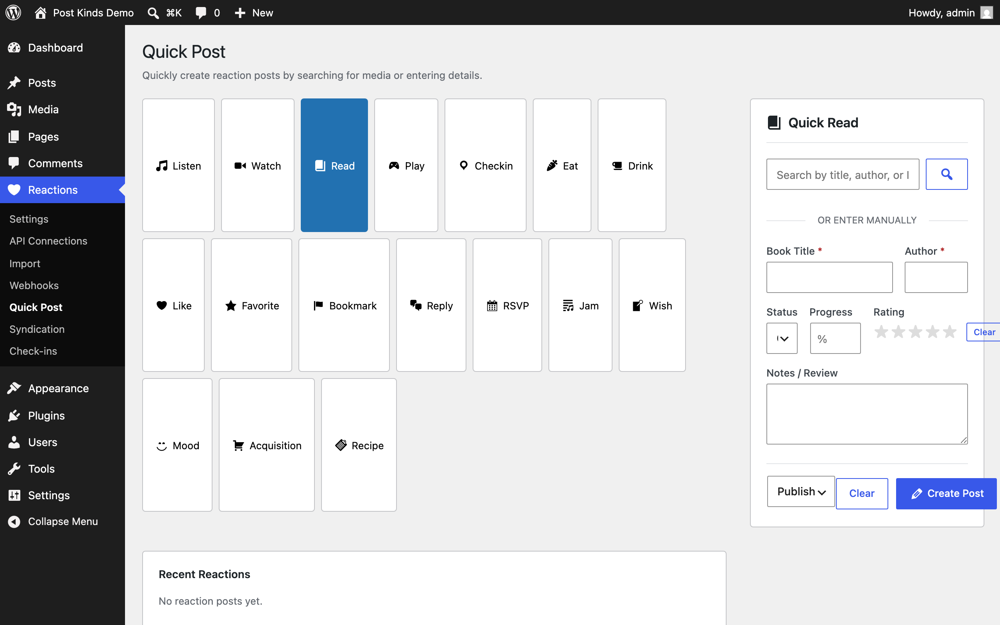

The screens Post Kinds for IndieWeb in Block Themes adds to WordPress. Every screenshot has a text equivalent in the page that documents the task, so you never need the image to follow the instructions.

Screenshots come from two repeatable sources — the capture script (`npm run screenshots:docs`, which runs against a disposable WordPress Playground) and assets that ship with the plugin — plus manual captures listed with full specifications at the end of this page.

## Editor

The **Post Kind** panel in the editor sidebar: pick a kind from the grid, or let auto-detection suggest one. See [Getting started](/post-kinds-for-indieweb/getting-started/).

The block inserter with the plugin's card and utility blocks. Search for the kind name or browse the Post Kinds category. See [Getting started](/post-kinds-for-indieweb/getting-started/).

A **Listen Card** in the editor: album art, artist, and rating filled by media lookup. See [Common tasks](/post-kinds-for-indieweb/common-tasks/).

A **Watch Card** with poster and review fields. See [Common tasks](/post-kinds-for-indieweb/common-tasks/).

A **Read Card** tracking a book with cover and progress. See [Common tasks](/post-kinds-for-indieweb/common-tasks/).

A **Checkin Card** with venue details — location privacy levels control what publishes. See [Privacy and data](/post-kinds-for-indieweb/privacy-and-data/).

An **RSVP Card**: record whether you're attending an event. See [Common tasks](/post-kinds-for-indieweb/common-tasks/).

A **Play Card**: log a game session with artwork filled for you. See [Common tasks](/post-kinds-for-indieweb/common-tasks/).

The **Star Rating** block: rate media in half-star steps. See [Common tasks](/post-kinds-for-indieweb/common-tasks/).

The **Media Lookup** block: search every connected media service from one block. See [Common tasks](/post-kinds-for-indieweb/common-tasks/).

## Front end

Three published check-ins at the public, approximate, and private levels: choose how precisely each check-in reveals where you were. See [Privacy and data](/post-kinds-for-indieweb/privacy-and-data/).

The **Check-in Dashboard** block: show your check-in history on any page. See [Common tasks](/post-kinds-for-indieweb/common-tasks/).

## Admin screens

**Reactions → Settings, General tab**: plugin defaults. See [Settings](/post-kinds-for-indieweb/settings/).

**Reactions → Settings, Integrations tab**: see which companion plugins the site already runs. See [Settings](/post-kinds-for-indieweb/settings/).

**Reactions → API Connections**: keys for the media lookup services. See [Settings](/post-kinds-for-indieweb/settings/).

**Reactions → Import**: bulk-import your history from connected services. See [Common tasks](/post-kinds-for-indieweb/common-tasks/).

**Reactions → Webhooks**: per-service webhook URLs and secrets for scrobbling from Plex, Jellyfin, Trakt, and ListenBrainz. See [Settings](/post-kinds-for-indieweb/settings/).

**Reactions → Quick Post**: create a reaction post without opening the editor. See [Settings](/post-kinds-for-indieweb/settings/).

