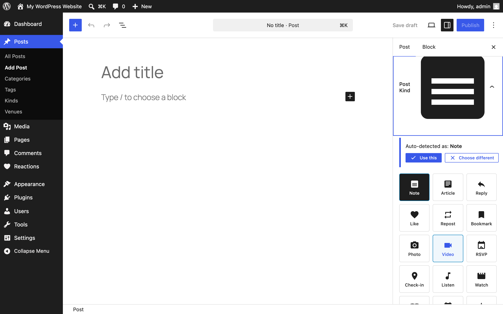
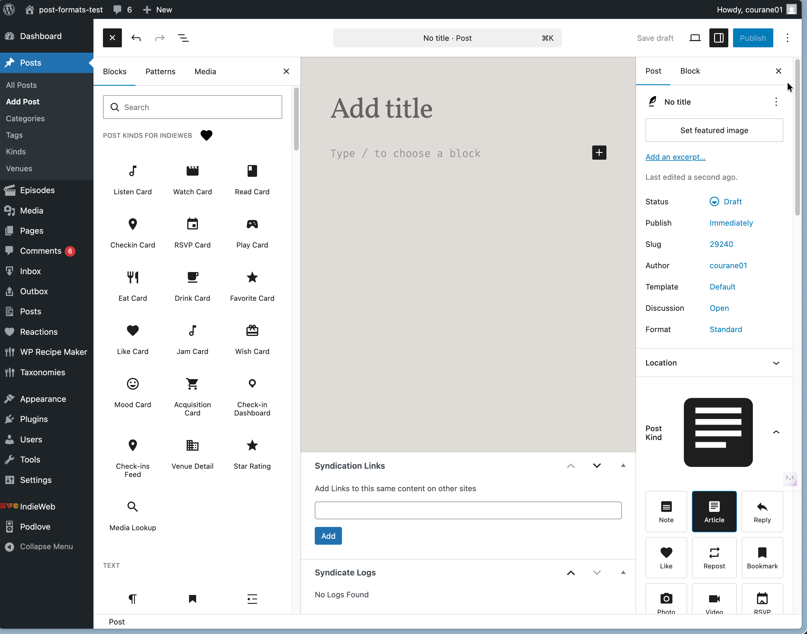
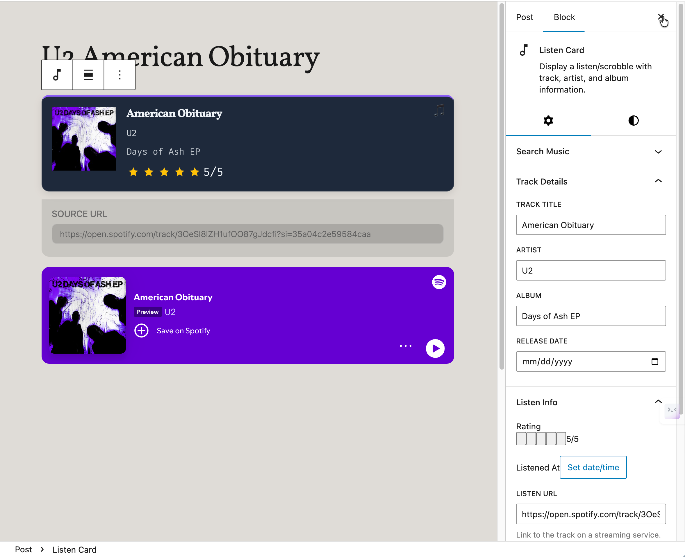
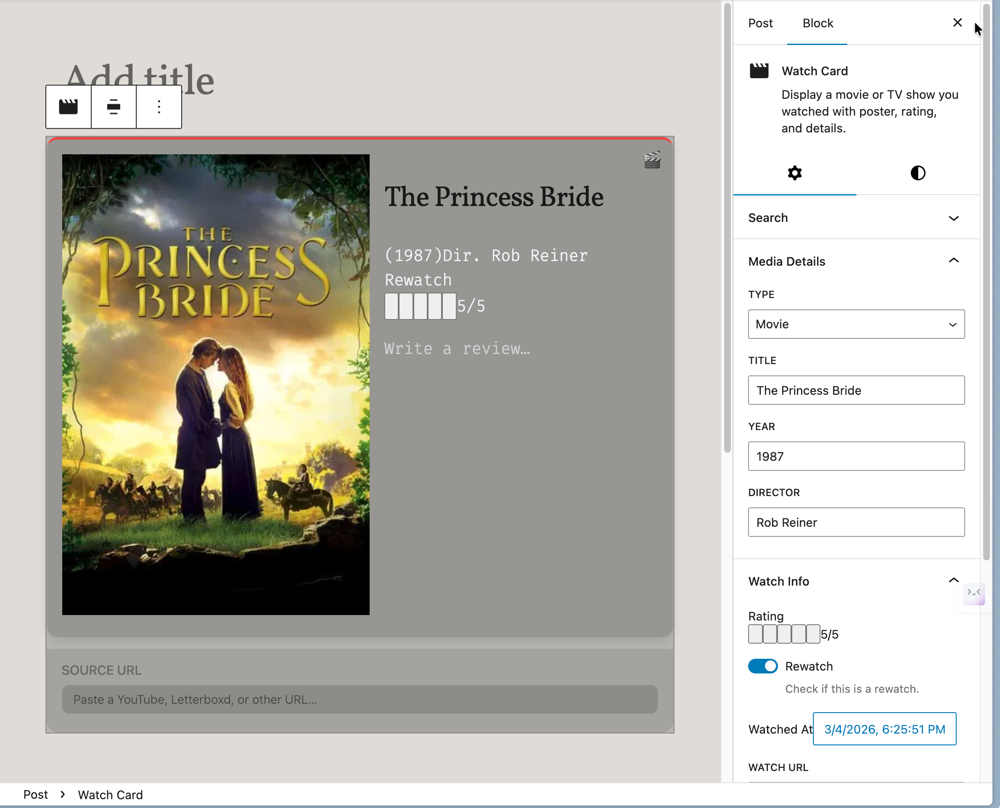
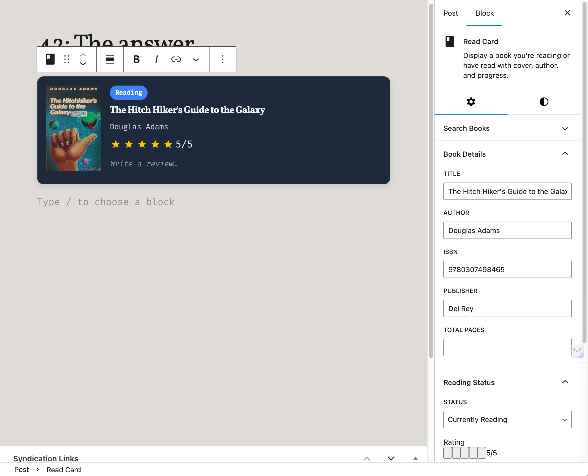
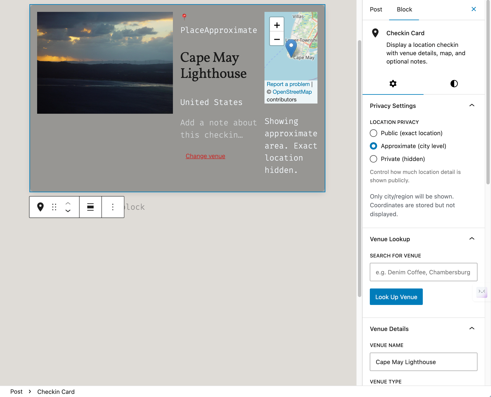
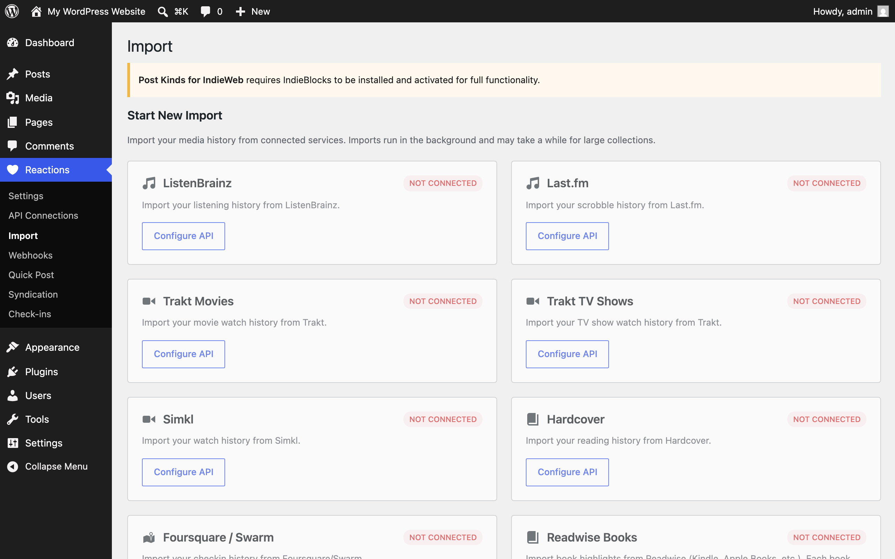
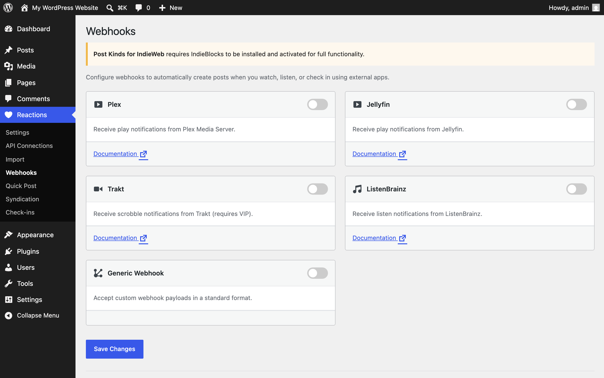

The screens Post Kinds for IndieWeb adds to WordPress. Every screenshot has a text equivalent in the page that documents the task, so you never need the image to follow the instructions.

Screenshots come from two repeatable sources — the capture script (`npm run screenshots:docs`, which runs against a disposable WordPress Playground) and assets that ship with the plugin — plus manual captures listed with full specifications at the end of this page.

## Editor

The **Post Kind** panel in the editor sidebar: pick a kind from the grid, or let auto-detection suggest one. See [Getting started](/post-kinds-for-indieweb/getting-started/).

The block inserter with the plugin's card and utility blocks. Search for the kind name or browse the Post Kinds category. See [Getting started](/post-kinds-for-indieweb/getting-started/).

A **Listen Card** in the editor: album art, artist, and rating filled by media lookup. See [Common tasks](/post-kinds-for-indieweb/common-tasks/).

A **Watch Card** with poster and review fields. See [Common tasks](/post-kinds-for-indieweb/common-tasks/).

A **Read Card** tracking a book with cover and progress. See [Common tasks](/post-kinds-for-indieweb/common-tasks/).

A **Checkin Card** with venue details — location privacy levels control what publishes. See [Privacy and data](/post-kinds-for-indieweb/privacy-and-data/).

## Admin screens

**Reactions → Settings, General tab**: plugin defaults. See [Settings](/post-kinds-for-indieweb/settings/).

**Reactions → API Connections**: keys for the media lookup services. See [Settings](/post-kinds-for-indieweb/settings/).

**Reactions → Import**: bulk-import your history from connected services. See [Common tasks](/post-kinds-for-indieweb/common-tasks/).

**Reactions → Webhooks**: per-service webhook URLs and secrets for scrobbling from Plex, Jellyfin, Trakt, and ListenBrainz. See [Settings](/post-kinds-for-indieweb/settings/).

## Screenshots still needed

Each row is the full capture specification. The repository's Playwright visual-regression suite (`tests/e2e/visual-regression.spec.js` with `tests/js/sample-values.js`) and the Playground blueprint can drive most of these with populated demo data; capture at 1280×800 at 2x.

| Filename | Screen and state | What to highlight | Alt text | Caption |
| --- | --- | --- | --- | --- |
| editor-rsvp-card.png | RSVP Card with a yes/no/maybe/interested state (baseline: rsvp-card-populated) | The response selector | RSVP Card block showing an event response | Record whether you're attending an event. |
| editor-play-card.png | Play Card with game cover via RAWG/BGG (baseline: play-card-populated) | Cover and platform fields | Play Card block with game cover and platform details | Log a game session with artwork filled for you. |
| editor-star-rating.png | Star Rating block on any card post (baseline: star-rating-populated) | A half-star rating | Star Rating block with half-star rating selected | Rate media in half-star steps. |
| editor-media-lookup.png | Media Lookup block with search results (needs one API key) | The results list | Media Lookup block showing search results | Search every connected media service from one block. |
| frontend-checkin-privacy-levels.png | Three published check-ins at public/approximate/private levels | The differing location detail | Three published check-ins showing how each privacy level redacts location detail | Choose how precisely each check-in reveals where you were. |
| frontend-checkin-dashboard.png | Check-in Dashboard block with several check-ins (baseline: checkin-dashboard-populated) | The grid and map | Check-in Dashboard block showing a grid of check-ins with map | Show your check-in history on any page. |
| admin-integrations-tab.png | Reactions → Settings, Integrations tab with IndieBlocks + Webmention installed | The Active status cards | Integrations tab with status cards for related plugins | See which companion plugins the site already runs. |
| admin-quick-post.png | Reactions → Quick Post with search results | Media search and manual entry form | Quick Post page with media search and manual entry form | Create a reaction post without opening the editor. |
