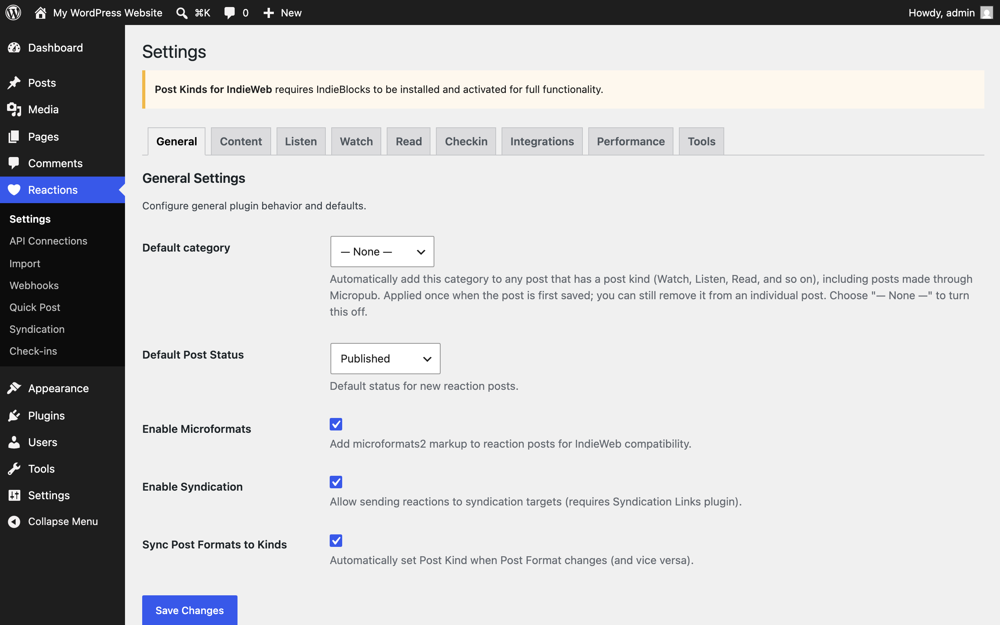
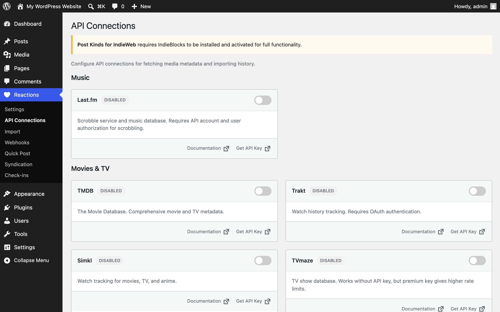

Every user-facing option lives under the **Reactions** menu (heart icon) in wp-admin. This page covers the tabbed Settings screen and the other Reactions pages: API Connections, Import, Webhooks, Quick Post, Syndication, and Check-ins.

Defaults below are the values the plugin registers in code. Settings, API Connections, Import, and Webhooks require the `manage_options` capability (administrators); Quick Post, Syndication, and Check-ins require `edit_posts` (authors and up).

## Settings page (Reactions → Settings)

The Settings page has nine tabs: **General, Content, Listen, Watch, Read, Checkin, Integrations, Performance, Tools**.

### General tab

| Setting | What it does | Default |
| --- | --- | --- |
| Default category | Automatically adds this category to any post that has a post kind (including posts made through Micropub). Applied once when the post is first saved; you can remove it from an individual post. Choose "— None —" to turn it off. Since 1.4.2 it applies only to stream-shaped posts (composer posts, Status/Aside formats, or activity kinds like listen/watch/checkin) — long-form articles and reviews don't get it. | None |
| Default Post Status | Status for new reaction posts: Published, Draft, Pending Review, or Private. | Published |
| Enable Microformats | Adds microformats2 markup to reaction posts for IndieWeb compatibility. Turn off only if another plugin or your theme handles microformats. | On |
| Enable Syndication | Allows sending reactions to syndication targets. The setting notes it requires the Syndication Links plugin. | On |
| Sync Post Formats to Kinds | Automatically sets the Post Kind when the Post Format changes, and vice versa, using a mapping table shown on this tab (for example Audio → listen, Video → watch, Link → bookmark, Image → photo). You can adjust the mapping per format. | On |

Note: earlier versions showed an **Enabled Reaction Types** checkbox grid here. It was removed on 2026-07-10 because nothing at runtime read it — disabling a kind never changed the editor, taxonomy, or blocks. The control returns if and when that enforcement is implemented.

### Content tab

| Setting | What it does | Default |
| --- | --- | --- |
| Auto-fetch Metadata | Automatically fetches metadata from external APIs when creating posts. | On |
| Cache Duration | How long to cache API responses: 1 hour, 6 hours, 12 hours, 24 hours, 3 days, or 1 week. | 24 hours |
| Image Handling | What to do with cover art and artwork from external sources: Download to Media Library (sideload), Link to External URL (hotlink), or Do Not Include Images. | Download to Media Library |

### Listen tab

| Setting | What it does | Default |
| --- | --- | --- |
| Auto-Sync Music | Automatically imports new music scrobbles from your connected music service. | Off |
| Music Import Source | Primary source for importing scrobble history: ListenBrainz or Last.fm. | ListenBrainz |
| Embed Player | Preferred music service for embedding players in listen posts: None, Spotify, Apple Music, YouTube Music, Bandcamp, or SoundCloud. The plugin searches for and embeds tracks from this service when importing. | None |
| Auto-Sync Podcasts | Automatically imports podcast episodes with highlights from Readwise/Snipd. | Off |
| Default Rating | Default rating for listen posts (0 = no rating). | 0 |
| Scrobble to Last.fm | Automatically scrobbles listen posts to Last.fm when published. Requires a Last.fm session key (connect on the API Connections page). This is a POSSE feature — it sends data out only when you turn it on. | Off |

### Watch tab

| Setting | What it does | Default |
| --- | --- | --- |
| Auto-Sync Movies & TV | Automatically imports movies and TV shows you watch. | Off |
| Import Source | Primary source for watch history: Trakt or Simkl. | Trakt |
| Default Rating | Default rating for watch posts (0 = no rating). | 0 |
| Include Rewatches | Creates posts for rewatched content (the screen warns this may create duplicates). | Off |
| Sync to Trakt | Automatically syncs watch posts to Trakt history when published. Requires a Trakt OAuth connection. POSSE feature, off unless you enable it. | Off |

### Read tab

| Setting | What it does | Default |
| --- | --- | --- |
| Auto-Sync Books | Automatically imports books you're reading or have read. | Off |
| Book Import Source | Primary source for book history: Hardcover or Readwise Books. Readwise imports include Kindle highlights. | Hardcover |
| Auto-Sync Articles | Automatically imports articles with highlights from Readwise. | Off |
| Default Read Status | Default status for new read posts: To Read, Currently Reading, Finished, or Abandoned. | To Read |

### Checkin tab

| Setting | What it does | Default |
| --- | --- | --- |
| Auto-Sync Checkins | Automatically imports check-ins from Foursquare/Swarm. | Off |
| Default Location Privacy | Default privacy level for new check-ins: **Public (exact location)** shows full address, venue name, and precise coordinates; **Approximate (city level)** shows city/region but hides street address and exact coordinates; **Private (hidden)** stores the location but never displays it publicly — for home, work, or other private places. | Public |
| Coordinate Handling | What happens to latitude/longitude: **Store but hide coordinates** (saved but never shown publicly), **Round coordinates** (rounded to about 1 km precision before storing), **Discard coordinates entirely** (only venue name and address text are stored; coordinates can't be recovered later), or **Store and show coordinates** (saved and displayed publicly when privacy is Public; enables precise mapping and geo microformats). | Store but hide coordinates |
| Venue Search Source | Which service powers venue search in the editor: OpenStreetMap (Nominatim), Foursquare (requires API key), or Both (Foursquare first, OSM fallback). | — |
| Sync to Foursquare | Posts check-ins to Foursquare when publishing. Requires a Foursquare OAuth connection. The screen describes it as a POSSE approach — Publish on your Own Site, Syndicate Elsewhere. | Off |
| Foursquare Connection | Connect/disconnect button for the Foursquare OAuth link used by import and sync. | Not connected |

See [Privacy and data](/post-kinds-for-indieweb/privacy-and-data/) for how privacy levels affect your site's public markup.

### Integrations tab

Status cards for related plugins — each shows whether the plugin is detected as active, with a short description and link:

- **IndieBlocks** — companion blocks for bookmarks, likes, replies, reposts.
- **Webmention** — cross-site conversations. Detected only; this plugin doesn't send or receive webmentions itself.
- **Syndication Links** — POSSE workflow support.
- **Bookmark Card** — enhanced bookmark previews.
- **Post Formats for Block Themes** — post format support in block themes; the card links to the format-to-kind mapping on the General tab.
- **WP Recipe Maker** — recipe kind support.
- **WordPress oEmbed** — embed support.

There are no settings to change here; it's a dashboard of what's installed.

### Performance tab

| Setting | What it does | Default |
| --- | --- | --- |
| Automatic Sync | Enables background sync (WP-Cron) for the auto-import toggles on the Listen/Watch/Read/Checkin tabs. | Off |
| Rate Limit Delay | Milliseconds to wait between API requests, to avoid provider rate limits. | 1000 ms |
| Import Batch Size | Number of items processed per batch during imports. | 50 |

### Tools tab

Maintenance actions rather than saved settings:

- **Clear API Cache** — clears cached responses from external APIs.
- **Clear Metadata Cache** — clears cached media metadata.
- **Clear All Caches** — clears everything cached.
- **Export Settings** — downloads settings as a JSON file. API keys are excluded from the export.
- **Import Settings** — restores settings from a JSON export.

## API Connections page (Reactions → API Connections)

Where you enter credentials for the external services that power media search, imports, and syndication. Each service card shows a description, links to the provider's docs and sign-up page, the credential fields it needs, and a connection test.

Services on this page: **Last.fm** (API key, shared secret, plus an authorize step for scrobbling), **TMDB** (movies/TV), **Trakt** (OAuth), **Simkl** (OAuth), **TVmaze**, **Open Library**, **Hardcover**, **Google Books**, **Foursquare** (OAuth), **Nominatim** (asks only for a contact email, required by the OpenStreetMap usage policy), **Readwise** (access token), **BoardGameGeek** (API token; the page notes BGG app approval can take a week or more, and that you can paste BGG URLs into the Play Card meanwhile), and **RAWG** (API key).

MusicBrainz and Open Library searches work without keys. Saved keys display masked (`****`); re-saving the form doesn't overwrite a stored key with the mask. Keys are stored in the WordPress options table — see [Privacy and data](/post-kinds-for-indieweb/privacy-and-data/).

## Import page (Reactions → Import)

Bulk-imports your history from connected services. Shows **Active Imports** (progress of running jobs) and **Start New Import** cards per service — services without credentials show "Not Connected" with a "Configure API" link; connected services offer **Preview**, **Start Import**, and **Re-sync**. Imports run in the background via WP-Cron; an admin notice shows while imports are running, with a link to view progress.

## Webhooks page (Reactions → Webhooks)

Webhooks let external apps push events to your site so posts are created automatically as you watch, listen, or check in (for example from Plex, Jellyfin, Trakt, or ListenBrainz). The page shows, per service:

- A **Webhook URL** to copy into the external service.
- A **Secret Key** with a Generate button. Incoming webhooks are verified with an HMAC-SHA256 signature; regenerating the secret invalidates the old one.
- A **Webhook Log** of recent deliveries, and a **Pending Scrobbles** count.

## Quick Post page (Reactions → Quick Post)

A fast composer for reaction posts without opening the block editor: search for media (Quick Listen and similar sections) or enter details manually, and the page creates the post. It also lists your recent reactions. Available to anyone who can edit posts.

## Syndication page (Reactions → Syndication)

Shows syndication status per post once syndication services are configured — which posts were **Syndicated**, which were **Skipped**, and a "Syndicate Now" action to send a skipped post to the service. If nothing is configured, it links you back to Settings.

## Check-ins page (Reactions → Check-ins)

A dashboard of your check-in posts (the admin counterpart to the front-end Check-in Dashboard block).
