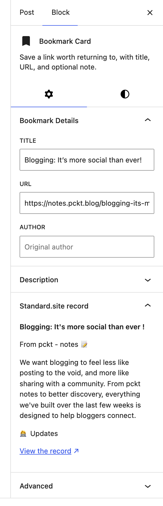

When you bookmark, like, reply to, or note that you read someone else's page, Post Kinds stores the URL and whatever it can work out from the page. If that page publishes a [standard.site](https://standard.site) record, there is something better available: the author's own metadata, written by them, read straight from their AT Protocol repository.

You get the title they gave it, their description, their tags, the publication it belongs to, and the date they published it. Not a scrape, and not a guess.

Nothing to set up. There is no account to connect, no key to paste, and no setting to switch on. Only sites that publish these records are affected, and everything else behaves exactly as before.

## Using it

1. Add a Bookmark, Like, Reply, Repost, Favorite, Jam, or Wish card to a post
2. Enter the URL you are citing
3. Open the block settings sidebar and find **Standard.site record**
4. Choose **Check this URL**



If the page publishes a record, the panel shows what the author wrote and a link to the record itself. If it does not, the panel says so. Most of the web does not publish these records yet, so that is the ordinary result rather than a sign that anything went wrong.

The check only runs when you ask for it. Nothing is fetched while you type, and the panel stays hidden until the block has a URL in it.

Posts you publish are also checked in the background, a few seconds after saving, so a record can be found without opening the sidebar at all.

## What "verified" means

A page claims a record by putting a tag in its HTML that names the record's address. On its own that is only a claim: any page can name any record, including one written by somebody else.

So the claim gets checked in both directions. Post Kinds reads the record, follows it back to the publication it belongs to, rebuilds the address that record says it lives at, and confirms that address is the page you started from. Only then does it count as verified.

An unverified record still appears in the sidebar, with a warning above it, because seeing it is more useful than hiding it. It is never saved to your post — an attribution that might be wrong is worse than none at all.

## Where the data goes

The checking described above reads; it does not write. Checking a URL sends nothing about you to anyone beyond an ordinary request for the page you already linked to.

Publishing your own posts as standard.site records is a separate job with its own section below — it runs through the [ATmosphere](https://wordpress.org/plugins/atmosphere/) plugin and only after you connect an account there.

See [Privacy and data](/post-kinds-for-indieweb/privacy-and-data/) for exactly which servers are contacted and when.

## Publishing your own posts

Post Kinds integrates with the optional [ATmosphere](https://wordpress.org/plugins/atmosphere/) companion plugin (2.1.0 or later), which publishes WordPress posts to AT Protocol — the `site.standard.publication` record for your site, a `site.standard.document` record per post, the `/.well-known` verification, and the link tags that let indexers confirm the records are really yours. ATmosphere owns all of that, including the account connection and everything that goes with it.

What Post Kinds adds is the part ATmosphere can't know:

- **Which kinds publish.** Public content and public logs publish by default: notes, articles, photos, videos, audio, reviews, recipes, events, quotes, questions, crafts — and your listens, watches, reads, plays, eats, drinks, and jams, plus replies, bookmarks, RSVPs, and issues. Thin signals (likes, reposts, favorites, follows, tags) and privacy-sensitive kinds (check-ins, moods, wishes, acquisitions, weather, exercise, sleep, trips, itineraries) stay off by default. Turn any kind on or off under **Settings → Post Kinds → Integrations**, or turn a single post on or off with ATmosphere's sharing toggle in the editor — the per-post toggle always wins, and changing the site setting never removes records that already published. The full per-kind reasoning lives in the repository's [eligibility decision table](https://github.com/courtneyr-dev/post-kinds-for-indieweb/blob/main/docs/integrations/standard-site-kind-eligibility.md).
- **Readable titles.** Standard.site requires every document to have a title; many kinds are intentionally untitled. Post Kinds derives one from the kind's own details — *Listened to Range Life by Pavement*, *Checked in at Powell's Books*, *RSVP: WordCamp US* — without ever touching your post. A private check-in derives just *Checked in*, no venue.
- **The kind as a tag.** A listen carries `listen` in the record's tags, a review carries `review`, so your posts stay discoverable as what they are.

To start publishing: install and activate both plugins, connect your AT Protocol account under **Settings → ATmosphere**, and publish normally. Existing posts can be brought over intentionally with `wp atmosphere backfill` (it honors the kind settings; run `--dry-run` first to see what it would do). Updating a post updates its record; unpublishing, trashing, or deleting removes it — ATmosphere handles all of that.

Standard.site documents and Bluesky posts are related but separate: whether a Bluesky post accompanies the document follows ATmosphere's settings, and Post Kinds never changes them.

If your site already has a standard.site publication record created by another tool, be aware that ATmosphere currently creates its own publication record rather than adopting an existing one — see the repository's [ATmosphere integration guide](https://github.com/courtneyr-dev/post-kinds-for-indieweb/blob/main/docs/integrations/atmosphere-standard-site.md) for the current state of that limitation before connecting.

## For developers

Resolution is available directly:

```php
$result = \PKIW\Standard_Site::resolve_url( 'https://example.com/a-post' );

if ( $result && $result['verified'] ) {
    echo $result['record']['title'];
    echo $result['publication']['record']['name'] ?? '';
}
```

`resolve_url()` returns `null` when the page publishes no record. When it finds one, the array holds:

### uri

The record's AT-URI, such as `at://did:plc:abc123/site.standard.document/3mp3nrm5leyim`.

### did

The identifier of whoever wrote it.

### record

The record itself, as the author wrote it. Follows the [document lexicon](https://standard.site/docs/lexicons/document/).

### publication

The publication the document belongs to, or `null` for a document that names no publication.

### verified

Whether the record points back at the URL it was found on, as described above.

Look a site up from its domain with `resolve_publication()`:

```php
$publication = \PKIW\Standard_Site::resolve_publication( 'https://notes.example.com' );
```

Results are cached for a day, including misses.

A resolved AT-URI is stored on the post in the `_pkiw_standard_site_uri` meta key, and only when verified. `Standard_Site::get_post_document_uri( $post_id )` reads it back.

The REST route behind the sidebar panel is `GET /post-kinds-indieweb/v1/resolve/standard-site?url=…`. It needs the `edit_posts` capability and allows 30 lookups per five minutes per person.

## Reading further

- [standard.site documentation](https://standard.site/docs/introduction/) — what the records are for
- [How verification works](https://standard.site/docs/verification/) — the specification behind the two-way check
- [Privacy and data](/post-kinds-for-indieweb/privacy-and-data/) — which servers are contacted
