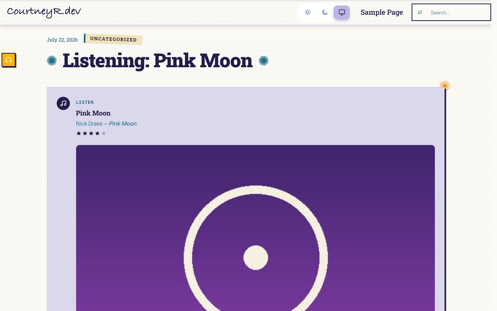
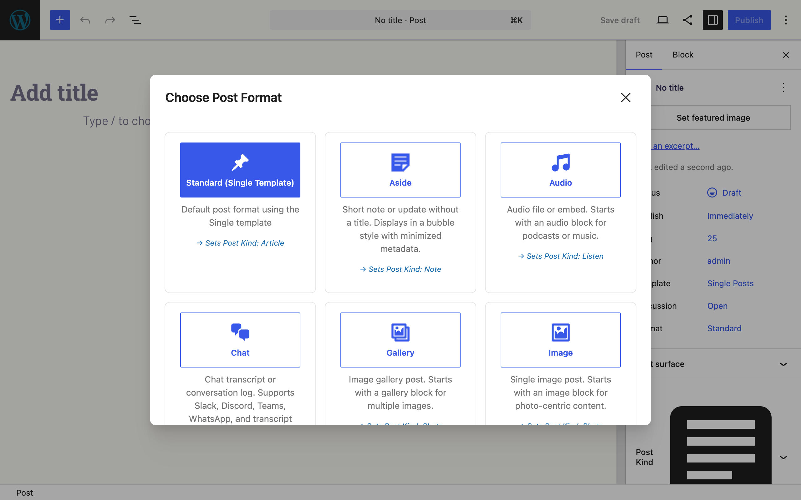
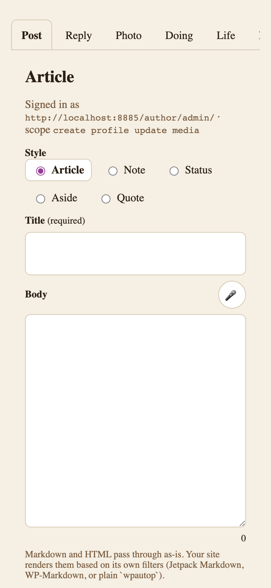

Post Kinds for IndieWeb in Block Themes is part of a small suite of IndieWeb plugins that detect each other and coordinate when they share a site: [Post Formats for Block Themes](https://courtneyr-dev.github.io/post-formats-for-block-themes/), [Link Extension for XFN](https://courtneyr-dev.github.io/link-extension-for-xfn/), and the [Outpost composer](https://courtneyr-dev.github.io/outpost/). Each plugin works alone; none of them requires the others.

The screenshots on this page come from a demo site running the whole suite with a styled block theme, so they show what readers see on a real site rather than a default install.

## Cards inherit your theme

A Listen Card on a styled theme: the card picks up the theme's palette, borders, and shadows instead of shipping its own look. With the Webmention plugin active, the same post grows a likes-and-reposts section and a reply-by-webmention form below the card.

## Kinds pair with post formats

With Post Formats for Block Themes active, its format modal advertises the kind mapping on every card — picking **Audio** sets the **Listen** kind, **Aside** sets **Note**, and so on. The **Post Kind** panel stays in the sidebar for kinds that have no format equivalent, like check-ins and RSVPs.

## Post kinds from your phone

The Outpost composer publishes to your site over Micropub. Kind-shaped posts — notes, replies, photos, listens — arrive as regular posts that this plugin's cards and microformats understand, so a listen logged from your phone renders as a full Listen Card on your site.

## What each plugin adds

- **Post Kinds for IndieWeb** — this plugin: card blocks, media lookup, microformats, imports, and webhooks.
- **Post Formats for Block Themes** — format patterns, detection, badges, and templates; formats map onto kinds automatically.
- **Link Extension for XFN** — relationship attributes on links in any post or card.
- **Outpost** — a phone-friendly composer that publishes via Micropub and IndieAuth.
